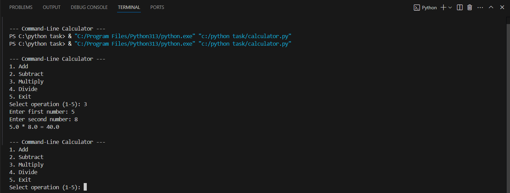
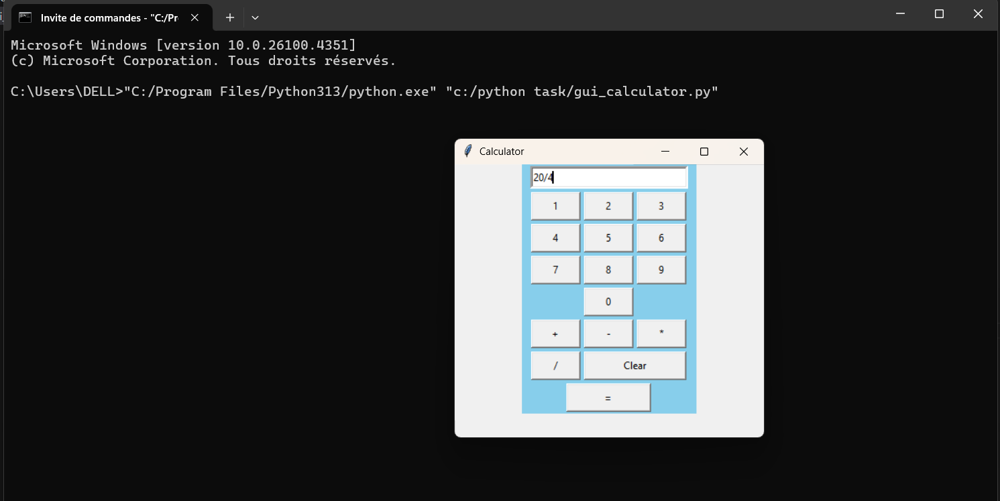

# Python-calculator
# Overview

This project includes two types of calculators written in Python:
1. CLI Calculator (Command-Line Interface) – using standard input/output in terminal.
2. GUI Calculator (Graphical User Interface) – using `tkinter` for a button-based interface.

# Tools Used

- **Python 3.13**
- **VS Code** (Visual Studio Code)
- **Command Prompt / Terminal**
- **Tkinter** (for GUI, comes built-in with Python)

---

# Files Included

- `calculator.py` – CLI calculator 
- `gui_calculator.py` – GUI calculator using Tkinter
- `README.md` – Project description

---

# Features & Functions

## CLI Calculator (`calculator.py`)

- Repeats operations in a loop until the user chooses to exit.
- Supports basic operations:
  ```python
  def add(n1, n2)
  def sub(n1, n2)
  def mul(n1, n2)
  def div(n1, n2)

## GUI Calculator (gui_calculator.py)
- Built using Tkinter.
- User-friendly interface with number and operator buttons.
Includes:

click(num): adds digits/operators to the input field.
equal(): evaluates the expression.
clear(): clears the screen.
Layout is managed using Tkinter's grid() system.

# Screenshots
<h3> CLI Calculator</h3>
<p align="center">
  
</p>

<h3> GUI Calculator (Tkinter)</h3>
<p align="center">
  
</p>
